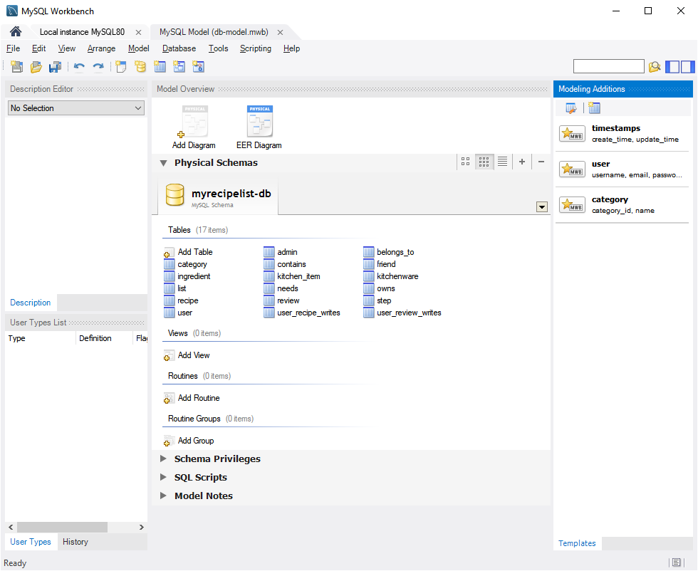
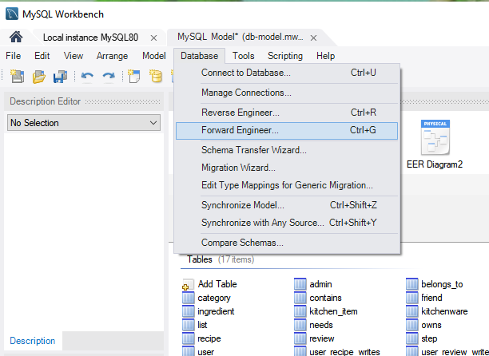
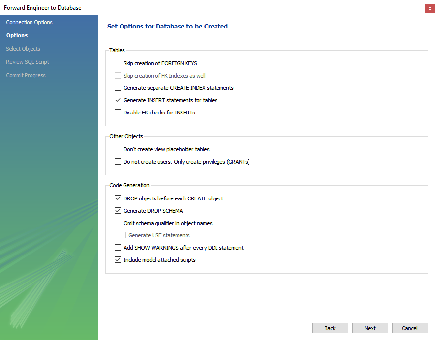

# 471 Final Project

This project was created by Navjot Brar, Minji Kim, and Jofred Cayabyab.

## First time installation instructions

Ensure node.js and MySQL Workbench + Server are installed on your computer.

To install, try running `npm run ins` in the folder. If that doesn't work, then try:

```
npm i
cd client
npm i
```

To initialize the database, open `utils/db-model.mwb`. You should see the following page:



Navigate to Database -> Forward Engineer...



Keep clicking Next. When you get to this page, ensure the settings are the same:



Now run `npm run dev`.

**ASIDE:** You may encounter errors regarding MySQL validation. In this case, run the following script:

```sql
ALTER USER 'root'@'localhost' IDENTIFIED WITH mysql_native_password BY '<password>'
```

`<password>` is the root password on your system. This is defaulted to `"root"` in our project, so you may edit this in the [index.js](./index.js) file.